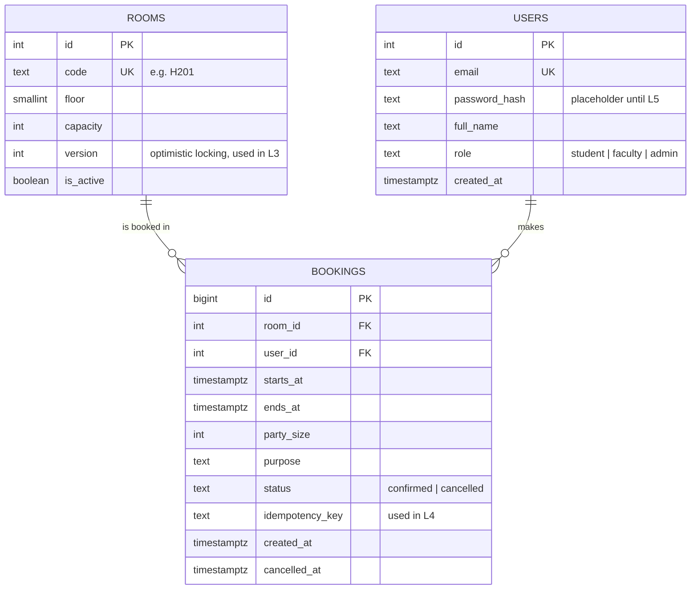

# BookSafe — ER Diagram

Both relationships are one-to-many. `bookings` is the associative table joining
rooms and users, and it is a full table rather than a join column because it
carries its own facts: the time window, the purpose, the party size.

## The rooms

| Rooms | Floor | Capacity |
|---|---|---|
| H101, H102, H103, H104, H105 | 1 | 40, 60, 80, 100, 150 |
| H201, H202, H203, H204, H205 | 2 | 40, 60, 80, 100, 150 |
| H301, H302, H303, H304 | 3 | 40, 60, 80, 100 |

14 rooms, 1140 seats total. Capacities are hardcoded facts about a physical
building — there is no formula deriving capacity from a room code.

## Constraints at a glance

| Constraint | Table | Guarantees |
|---|---|---|
| `no_overlapping_bookings` | bookings | No two confirmed bookings share a room *and* overlap in time |
| `ends_after_starts` | bookings | No zero-length or reversed bookings |
| `max_24h` | bookings | No booking longer than 24 hours |
| `rooms_code_key` | rooms | Room codes are unique |
| `rooms_capacity_check` | rooms | Capacity is positive |
| FK `room_id`, `user_id` | bookings | No booking for a room or user that does not exist |
